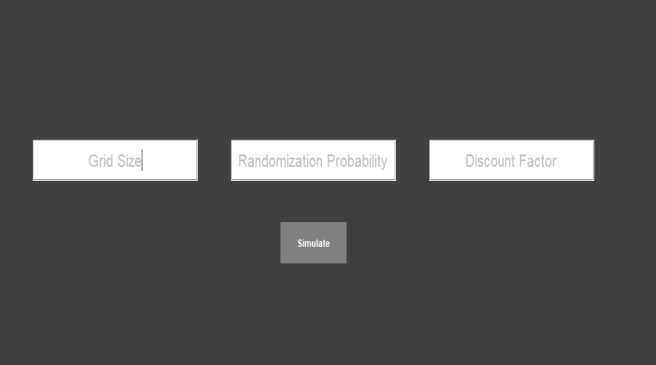
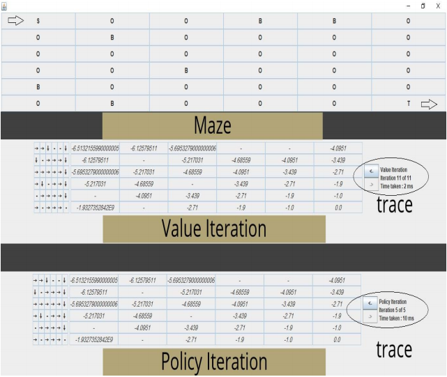

# Maze Solver
---
## Overview 
The program will generate a maze of size NxN, with barriers at random locations. It will then try to learn the path out of the grid using policy iteration and value iteration.

---
## Assumptions
* The following table shows the corresponding rewards for each type of cell:

| Cell Type | Reward |
| --------- |:------:|
| Start     | -1     |
| Middle    | -1     |
| Barrier   | -2147483648 (minimum integer in Java) |
| End       | 0      | 

* We only permit actions that have effect. In other words, each corner cell has only 2 actions, each edge cell has 3 actions and any other middle cell has the 4 default actions.
* The program has 3 inputs:
    1. N: The grid world size.
    2. P: the probability of barriers. 0 ≤ 𝑃 ≤ 1
    3. γ: The discount factor 0 ≤ 𝛾 < 1
Note that the discount factor can’t be 1 to prevent possible infinite loops in Policy Iteration.
* The algorithms terminate if any of the following conditions holds:
    1. The difference between two consecutive iterations is less than .001
    2. The number of iterations has reached 109
* The recommended configuration of the maze to really measure the performance is: {N: 8, P: 0.2, γ: .9}
---
## UI

---